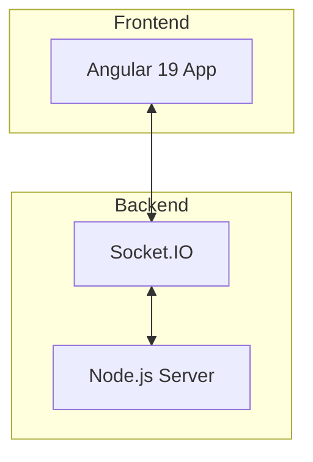
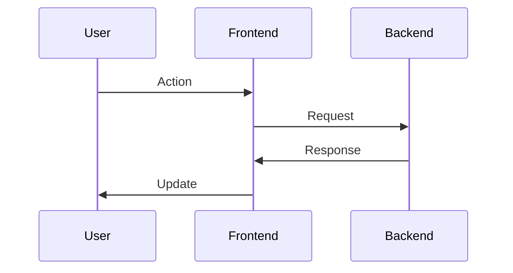

# Architecture Document: [Feature/System Name]

**Version**: 1.0
**Date**: YYYY-MM-DD
**Status**: Draft | Review | Approved
**PRD Reference**: docs/prd.md

---

## 1. High-Level Overview

### 1.1 Summary
<!-- Brief description of the architectural approach -->


### 1.2 Architecture Diagram


### 1.3 Key Architectural Decisions
| Decision | Rationale | Alternatives Considered |
|----------|-----------|------------------------|
| | | |

---

## 2. Tech Stack

<!-- Single source of truth for technology choices -->

### 2.1 Frontend
| Technology | Version | Purpose |
|------------|---------|---------|
| Angular | 19.x | SPA Framework |
| TypeScript | 5.x | Type safety |
| RxJS | 7.x | Reactive programming |
| Socket.IO Client | 4.x | Real-time communication |
| ngx-translate | 16.x | i18n |

### 2.2 Backend
| Technology | Version | Purpose |
|------------|---------|---------|
| Node.js | 20.x | Runtime |
| Express | 4.x | HTTP server |
| Socket.IO | 4.x | WebSocket server |

### 2.3 Infrastructure
| Technology | Purpose |
|------------|---------|
| Docker | Containerization |
| nginx | Frontend proxy |

---

## 3. Data Models

### 3.1 Entity: [Name]
```typescript
interface EntityName {
  id: string;
  // properties
}
```

**Relationships**:
-

---

## 4. Component Architecture

### 4.1 Component: [Name]
- **Responsibility**:
- **Location**: `src/app/...`
- **Dependencies**:
- **Interfaces**:

---

## 5. API Specifications

### 5.1 Socket.IO Events

#### Event: [name]
- **Direction**: Client → Server | Server → Client
- **Payload**:
```typescript
interface EventPayload {
}
```
- **Response**:

### 5.2 REST Endpoints (if any)
| Method | Endpoint | Description | Auth |
|--------|----------|-------------|------|
| | | | |

---

## 6. Core Workflows

### 6.1 Workflow: [Name]


---

## 7. Source Tree

```
src/app/
├── _components/
│   ├── game/           # Game components
│   └── players/        # Player components
├── _shared/
│   ├── _components/    # Shared components
│   ├── _helpers/       # Services
│   └── _models/        # Interfaces
└── services/           # Core services
```

---

## 8. Security Considerations

### 8.1 Authentication
-

### 8.2 Data Validation
-

### 8.3 Security Checklist
- [ ] Input validation
- [ ] XSS prevention
- [ ] CSRF protection (if applicable)

---

## 9. Error Handling Strategy

### 9.1 Frontend
-

### 9.2 Backend
-

---

## 10. Testing Strategy

### 10.1 Unit Tests
- Framework: Karma/Jasmine
- Coverage target: 80%

### 10.2 Integration Tests
-

---

## 11. Change Log

| Date | Version | Description | Author |
|------|---------|-------------|--------|
| | 1.0 | Initial draft | |
