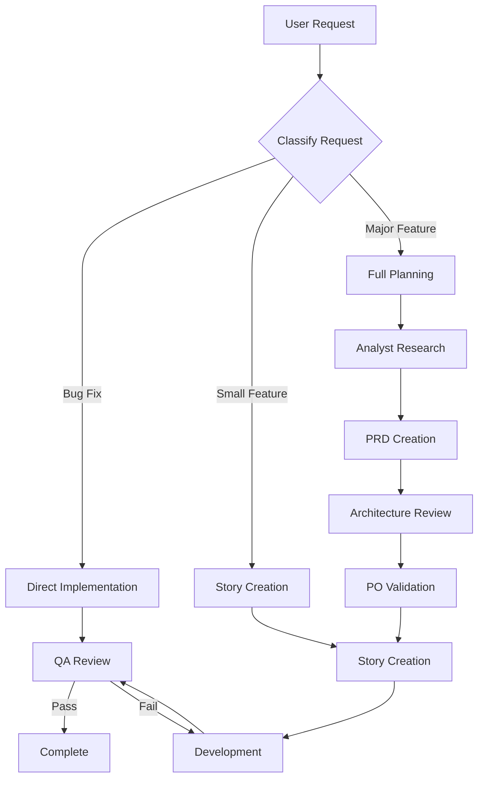

# Brownfield Full-Stack Enhancement Workflow

This workflow manages enhancements to the existing Ketal application through coordinated agent collaboration.

## Workflow Overview



## Phase 1: Classification

### Input
- User request or feature idea

### Process
Determine request type:
1. **Bug Fix**: Known issue, clear fix → Direct to Dev
2. **Small Feature**: Single epic, few stories → Create stories
3. **Major Feature**: Multiple epics, architectural impact → Full planning

### Output
- Classification decision
- Routing to appropriate path

---

## Phase 2: Analysis (Major Features)

### Agent: Analyst
```
Task tool:
  subagent_type: "Explore"
  description: "Analyze codebase for [feature]"
  prompt: |
    Analyze the Ketal codebase for implementing [feature].

    Questions to answer:
    1. What existing code is relevant?
    2. What patterns are currently used?
    3. What constraints exist?
    4. What are the technical options?

    Output: Structured analysis report
```

### Deliverable
- Codebase analysis
- Technical options
- Recommendations

---

## Phase 3: PRD Creation

### Agent: PM
```
Task tool:
  subagent_type: "general-purpose"
  description: "Create PRD for [feature]"
  prompt: |
    Create a PRD using .bmad/templates/prd-template.md

    Include:
    - Goals and success criteria
    - Functional requirements
    - Non-functional requirements
    - Epic structure
    - Acceptance criteria

    Reference: Analyst findings
    Output: docs/prd.md
```

### Quality Gate
- Run PM checklist
- User approval required

---

## Phase 4: Architecture

### Agent: Architect
```
Task tool:
  subagent_type: "Plan"
  mode: "plan"
  description: "Design architecture for [feature]"
  prompt: |
    Design architecture using .bmad/templates/architecture-template.md

    Include:
    - Component design
    - Data models
    - API specifications
    - Integration approach

    Constraints:
    - Angular 19 patterns (signals, standalone, OnPush)
    - Socket.IO for real-time
    - Existing code patterns

    Output: docs/architecture.md
```

### Quality Gate
- Run architect checklist
- User approval required

---

## Phase 5: Validation

### Agent: PO
```
Task tool:
  subagent_type: "general-purpose"
  description: "Validate requirements"
  prompt: |
    Review PRD and architecture for [feature].

    Validate:
    - Business value alignment
    - Completeness of requirements
    - Feasibility of approach
    - Acceptance criteria clarity

    Output: Approval or feedback
```

---

## Phase 6: Story Creation

### Agent: SM
```
Task tool:
  subagent_type: "general-purpose"
  description: "Create stories for [epic]"
  prompt: |
    Create detailed stories using .bmad/templates/story-template.md

    For each story include:
    - User story format
    - Acceptance criteria
    - Tasks breakdown
    - Relevant files with line numbers
    - Architecture context
    - Testing requirements

    Reference: PRD, Architecture docs
    Output: docs/stories/[epic].[story].md
```

### Quality Gate
- Run story-draft-checklist

---

## Phase 7: Development

### Agent: Dev
```
Task tool:
  subagent_type: "general-purpose"
  mode: "acceptEdits"
  description: "Implement [story]"
  prompt: |
    Implement story from docs/stories/[story].md

    Follow:
    - Acceptance criteria
    - Architecture guidelines
    - Ketal coding standards
    - Angular 19 patterns

    Include:
    - Implementation
    - Unit tests
    - Story record update
```

---

## Phase 8: QA Review

### Agent: QA
```
Task tool:
  subagent_type: "general-purpose"
  description: "Review [story] implementation"
  prompt: |
    Review implementation for docs/stories/[story].md

    Check:
    - Acceptance criteria met
    - Code quality
    - Test coverage
    - Security
    - Angular 19 compliance

    Run: story-dod-checklist
    Output: QA report in story file
```

### Quality Gate
- APPROVED → Story complete
- NEEDS_REVISION → Back to Dev

---

## Iteration

Repeat Phase 6-8 for each story until epic complete.
Repeat for each epic until feature complete.

---

## Quick Paths

### Bug Fix Path
1. User reports bug
2. Dev agent investigates and fixes
3. QA validates fix
4. Complete

### Small Feature Path
1. User requests feature
2. SM creates stories (skip PRD/Architecture)
3. Dev implements
4. QA reviews
5. Complete
