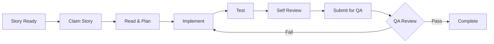

# Development Cycle Workflow

Standard development cycle for implementing stories in the Ketal project.

## Overview



## Step 1: Claim Story

### Check Available Stories
```
TaskList → Find stories with:
- status: pending
- owner: none
- blockedBy: empty
```

### Claim
```
TaskUpdate:
  taskId: [story_id]
  status: in_progress
  owner: dev-agent
```

## Step 2: Read & Understand

### Load Context
1. Read the story file: `docs/stories/[story].md`
2. Review referenced files
3. Check architecture docs if needed
4. Understand acceptance criteria

### Plan Approach
- Identify changes needed
- Plan implementation order
- Note potential challenges

## Step 3: Implement

### Guidelines
- Follow story tasks in order
- Use Angular 19 patterns:
  - `signal()` for state
  - Standalone components
  - OnPush change detection
  - `@if`, `@for`, `@switch`
  - `inject()` for DI
- Follow existing patterns in codebase
- Handle errors appropriately

### Incremental Progress
- Implement one task at a time
- Verify each change works
- Commit logical chunks

## Step 4: Test

### Unit Tests
```bash
npm test
```

### Manual Verification
- Test all acceptance criteria
- Check edge cases
- Verify no regressions

### Coverage Check
```bash
npm run test:coverage
```
Target: 80% coverage

## Step 5: Self Review

### Code Quality
- [ ] Clean and readable
- [ ] No duplication
- [ ] Proper error handling
- [ ] Follows patterns

### Angular 19 Compliance
- [ ] Signals used correctly
- [ ] Standalone component
- [ ] OnPush enabled
- [ ] New control flow

### Story Checklist
Run: `.bmad/checklists/story-dod-checklist.md`

## Step 6: Update Story Record

In the story file, update Dev Agent Record:
```markdown
## Dev Agent Record

### Implementation Notes
[Summary of what was done]

### Files Changed
- path/to/file.ts - description

### Completion Status
- [x] All acceptance criteria met
- [x] Tests passing
- [x] Ready for QA
```

## Step 7: Submit for QA

### Update Status
```
TaskUpdate:
  taskId: [story_id]
  status: Review
```

### Trigger QA
```
Task tool:
  subagent_type: "general-purpose"
  description: "QA review [story]"
  prompt: "Review implementation for [story]. Run DoD checklist."
```

## Step 8: Handle QA Feedback

### If APPROVED
```
TaskUpdate:
  taskId: [story_id]
  status: completed
```

### If NEEDS_REVISION
1. Read QA feedback
2. Address issues
3. Re-test
4. Resubmit

## Best Practices

### Do
- Read the full story before starting
- Ask questions if unclear
- Test thoroughly
- Update documentation

### Don't
- Skip acceptance criteria
- Ignore edge cases
- Leave console.logs
- Break existing functionality

### Ketal-Specific
- Use GameService signals for game state
- Socket.IO for real-time updates
- ngx-translate for user text
- Follow existing component patterns
